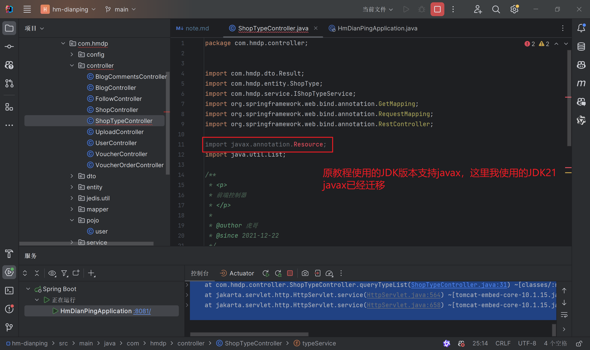
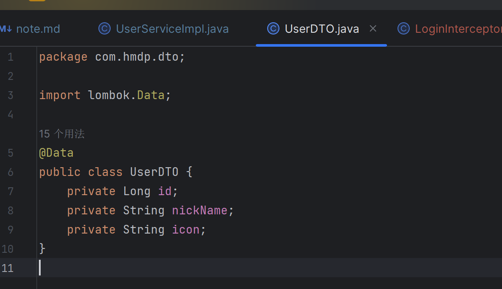

# 点评笔记
更详细的可以参考https://blog.csdn.net/qq_66345100/article/details/131986713
包括业务逻辑等

以下是本人自留
# redis客户端
## 可能出现的问题
### 1. redis连接失败
可能是虚拟机重新打开后ip地址改变，需要重新配置ip地址

## springboot配置jedis
### 配置依赖项
先从官网（github项目地址)找到对应的Maven依赖

复制到pom.xml文件当中，刷新Maven依赖；

由红变白就是依赖包下载完成，另外要配置单元测试的junit包

### 连接jedis
创建redis实例后，创建setup方法配置连接设置

### 单元测试
@BeforeEach注解

通过set、get方法存入、获取redis数据

内存回收，防止空指针

执行测试用例，查看结果：

哈希类型测试：

### Jedis 线程池
线程池工具类：

修改测试里的连接配置：

报错了，问了deepseek说是方法是旧版本，教程里是3.x
这里2025.8.16官方依赖是6.x

按照ds结论，决定修改springboot版本为3.x;
其他配置项也有响应修改；

所有的jakarta 修改为jakarta

修改JedisConnectionFactory工具类的方法:

之后就可以运行了：

## SpringDataRedis
* 整合了Lettuce和Jedis;
* 提供了RedisTemplate类统一API来操作redis;
* 支持redis的发布订阅模型
* 支持redis哨兵和redis集群
* 支持基于JDK、JSON、字符串、Spring对象的数据序列化和反序列化
* 支持基于redis的JUKCollection实现
### 快速入门
#### 文件配置
注意版本不同配置略有变化

#### 测试
1. 代码编写(ps：这里的忘记加上@Autowired注解了)

2. 此时存入的不是字符串：

3. debug查看数据情况：

这样存入的数据可读性较差，并且键值也会修改失败；
另外存储占用的空间也较大，因此需要修改默认的序列化设置；
4. 修改默认的序列化设置

这里key和value的序列化方式调用的参数不一致，询问ai得知：
这里的RedisSerializer.string()方法是静态实例创建的，因此不需要new

也就是说，这里的key是序列化为了字符串，而value是序列化为了对象(json格式)，
保持可读性的同时能够存储复杂的对象信息。

修改后尝试运行单元测试：

5. 尝试存入对象
新建一个类用于测试,数据保存时会存入json类型数据，包括对象类型和值；
这样获取数据时能够自动反序列化为对应的对象类型，但是增加了存储空间和数据处理时间开销；

6. 考虑到存储空间的额外开销，一般不使用json自动序列化和反序列化，而是统一使用String序列化器，要求只存储字符串数据；
需要存储对象数据时，手动完成序列化和反序列化；
spring提供了一个StringRedisTemplate类，序列化方式默认为StringRedisSerializer

# 黑马点评项目实战
## 导入项目文件
### 导入后端项目及数据库
navicat新建数据库，输入数据库名，选择utf8编码：

导入数据库文件：

将项目文件复制到自己的开发文件夹，修改yaml文件配置及pom文件配置

启动项目，没有报错之后访问：http://localhost:8080/shop-type/list

这里我出现了报错：

查询对应的链接发现

需要将项目当中所有jakarta 相关的包修改为jakarta

重新启动后刷新页面，可以获取到数据库中的数据就是启动成功

### 导入前端项目
前端项目文件复制到自己的开发文件夹，在nginx文件夹下cmd命令行运行start nginx.exe

成功后访问：http://localhost/8080 刷新后可以看到对应页面

## 短信验证功能
### 基于Session实现登录
功能逻辑
其中threadLocal变量用于保存当前线程的session对象，
每个请求是单独都线程，保存对应的信息，线程之间不共享数据，互不干扰；

#### 验证码发送
1）需要有可用手机号才能发送验证码
2）验证码发送成功之后，将验证码保存在session中，用于后续验证
3）模拟验证码发送，使用log打印

#### 验证
1）需要有手机号和验证码才能验证
2）验证码验证成功之后，判断用户是否存在，
存在则保存到session中，不存在则创建用户并保存到数据库及session中
注：这里不需要返回登录凭证（如token）,因为session会生成cookie，自带登录凭证

#### 配置拦截器
拦截器用于判断用户是否登录，如果登录则放行，否则返回登录页面；
配置拦截器后，就不用每个请求都手动判断用户是否登录了
1）拦截器逻辑

2）配置拦截器

#### 隐藏用户敏感信息
直接使用user类存入的信息包含用户密码等敏感信息，另外也会占用存储空间，
进行拦截校验所需要的信息只要存入基础信息，因此创建一个UserDTO类，继承User类，只包含基础信息（源码已创建）

#### session集群共享问题
多台tomcat服务器之间session不共享存储空间，请求切换到不同服务器时session数据丢失；
数据拷贝：内存空间浪费+拷贝时间开销导致数据不一致
redis替代session：数据共享、内存存储、key/value结构
#### 基于redis代替共享session实现登录
1）验证码保存数据结构：key：phone（注意唯一性及客户端能够使用key获取数据），value：code（string）
2）用户对象保存：
    * hash结构（可以将对象当中每个字段单独保存，对单个字段crud且内存占用更少）
    * key:随机token（数据保存在前端，存在安全风险）

具体代码修改(详见教程)：
UserServiceImpl.java(sendcode、login)
LoginInterceptor.java等

双拦截器：一个拦截，一个刷新token（单个拦截器部分拦截，可能导致token过期不刷新）
将刷新逻辑转移至第一个拦截器当中

移除原拦截器相关逻辑，只校验用户是否存在ThreadLocal当中

修改拦截器配置（MVCConfig）

