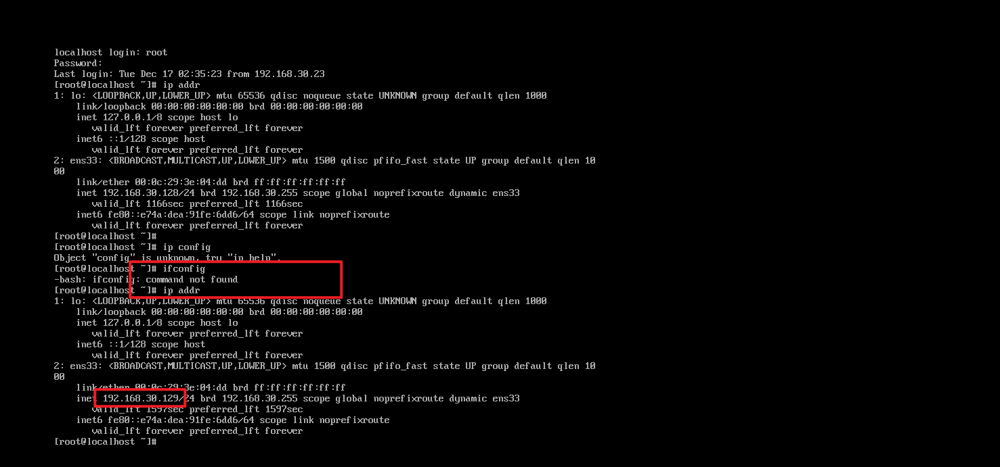
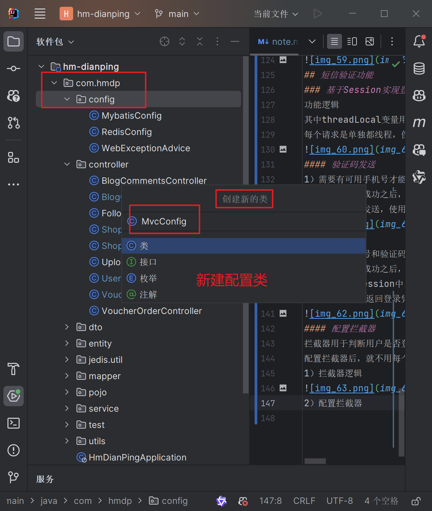
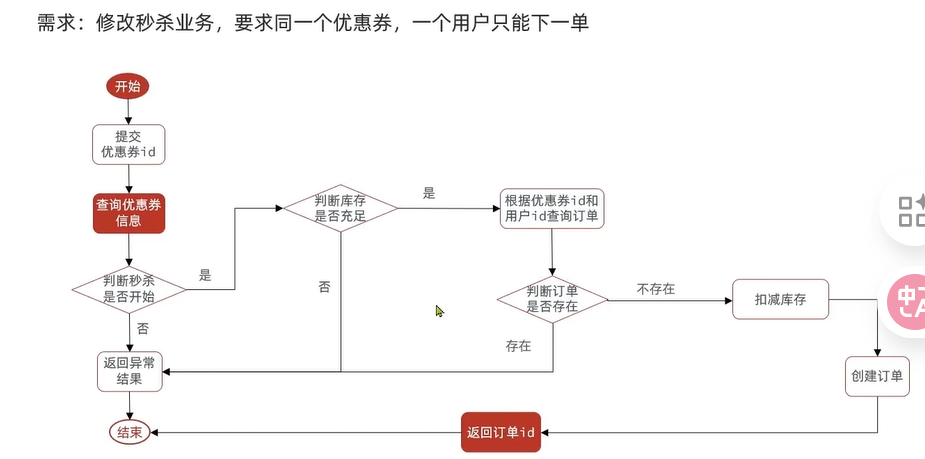
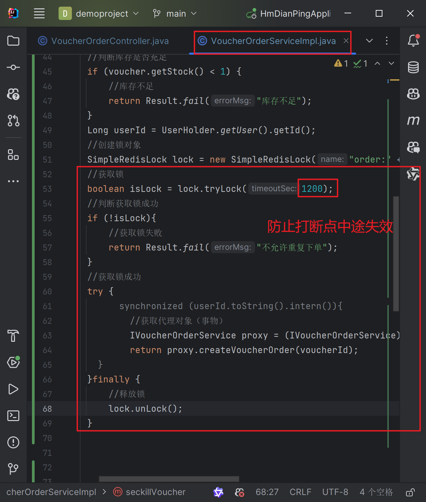
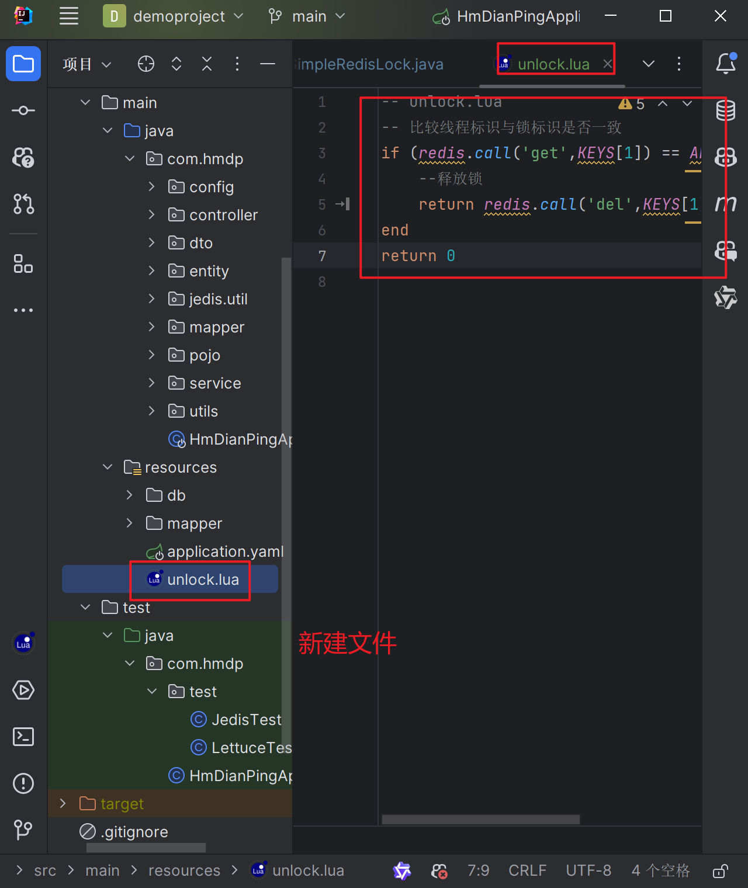

# 点评笔记
更详细的可以参考https://blog.csdn.net/qq_66345100/article/details/131986713
包括业务逻辑等

以下是本人自留
# redis客户端
## 可能出现的问题
### 1. redis连接失败
可能是虚拟机重新打开后ip地址改变，需要重新配置ip地址

## springboot配置jedis
### 配置依赖项
先从官网（github项目地址)找到对应的Maven依赖

复制到pom.xml文件当中，刷新Maven依赖；

由红变白就是依赖包下载完成，另外要配置单元测试的junit包

### 连接jedis
创建redis实例后，创建setup方法配置连接设置

### 单元测试
@BeforeEach注解

通过set、get方法存入、获取redis数据

内存回收，防止空指针

执行测试用例，查看结果：

哈希类型测试：

### Jedis 线程池
线程池工具类：

修改测试里的连接配置：

报错了，问了deepseek说是方法是旧版本，教程里是3.x
这里2025.8.16官方依赖是6.x

按照ds结论，决定修改springboot版本为3.x;
其他配置项也有响应修改；

所有的jakarta 修改为jakarta

修改JedisConnectionFactory工具类的方法:

之后就可以运行了：

## SpringDataRedis
* 整合了Lettuce和Jedis;
* 提供了RedisTemplate类统一API来操作redis;
* 支持redis的发布订阅模型
* 支持redis哨兵和redis集群
* 支持基于JDK、JSON、字符串、Spring对象的数据序列化和反序列化
* 支持基于redis的JUKCollection实现
### 快速入门
#### 文件配置
注意版本不同配置略有变化

#### 测试
1. 代码编写(ps：这里的忘记加上@Autowired注解了)

2. 此时存入的不是字符串：

3. debug查看数据情况：

这样存入的数据可读性较差，并且键值也会修改失败；
另外存储占用的空间也较大，因此需要修改默认的序列化设置；
4. 修改默认的序列化设置

这里key和value的序列化方式调用的参数不一致，询问ai得知：
这里的RedisSerializer.string()方法是静态实例创建的，因此不需要new

也就是说，这里的key是序列化为了字符串，而value是序列化为了对象(json格式)，
保持可读性的同时能够存储复杂的对象信息。

修改后尝试运行单元测试：

5. 尝试存入对象
新建一个类用于测试,数据保存时会存入json类型数据，包括对象类型和值；
这样获取数据时能够自动反序列化为对应的对象类型，但是增加了存储空间和数据处理时间开销；

6. 考虑到存储空间的额外开销，一般不使用json自动序列化和反序列化，而是统一使用String序列化器，要求只存储字符串数据；
需要存储对象数据时，手动完成序列化和反序列化；
spring提供了一个StringRedisTemplate类，序列化方式默认为StringRedisSerializer

# 黑马点评项目实战
## 导入项目文件
### 导入后端项目及数据库
navicat新建数据库，输入数据库名，选择utf8编码：

导入数据库文件：

将项目文件复制到自己的开发文件夹，修改yaml文件配置及pom文件配置

启动项目，没有报错之后访问：http://localhost:8080/shop-type/list

这里我出现了报错：

查询对应的链接发现

需要将项目当中所有jakarta 相关的包修改为jakarta

重新启动后刷新页面，可以获取到数据库中的数据就是启动成功

### 导入前端项目
前端项目文件复制到自己的开发文件夹，在nginx文件夹下cmd命令行运行start nginx.exe

成功后访问：http://localhost/8080 刷新后可以看到对应页面

## 短信验证功能
### 基于Session实现登录
功能逻辑
其中threadLocal变量用于保存当前线程的session对象，
每个请求是单独都线程，保存对应的信息，线程之间不共享数据，互不干扰；

#### 验证码发送
1）需要有可用手机号才能发送验证码
2）验证码发送成功之后，将验证码保存在session中，用于后续验证
3）模拟验证码发送，使用log打印

#### 验证
1）需要有手机号和验证码才能验证
2）验证码验证成功之后，判断用户是否存在，
存在则保存到session中，不存在则创建用户并保存到数据库及session中
注：这里不需要返回登录凭证（如token）,因为session会生成cookie，自带登录凭证

#### 配置拦截器
拦截器用于判断用户是否登录，如果登录则放行，否则返回登录页面；
配置拦截器后，就不用每个请求都手动判断用户是否登录了
1）拦截器逻辑

2）配置拦截器

#### 隐藏用户敏感信息
直接使用user类存入的信息包含用户密码等敏感信息，另外也会占用存储空间，
进行拦截校验所需要的信息只要存入基础信息，因此创建一个UserDTO类，继承User类，只包含基础信息（源码已创建）

### session集群共享问题
多台tomcat服务器之间session不共享存储空间，请求切换到不同服务器时session数据丢失；
数据拷贝：内存空间浪费+拷贝时间开销导致数据不一致
redis替代session：数据共享、内存存储、key/value结构
### 基于redis代替共享session实现登录
1）验证码保存数据结构：key：phone（注意唯一性及客户端能够使用key获取数据），value：code（string）
2）用户对象保存：
    * hash结构（可以将对象当中每个字段单独保存，对单个字段crud且内存占用更少）
    * key:随机token（数据保存在前端，存在安全风险）

具体代码修改(详见教程)：
UserServiceImpl.java(sendcode、login)
LoginInterceptor.java等

#### 双拦截器
一个拦截，一个刷新token（单个拦截器部分拦截，可能导致token过期不刷新）
将刷新逻辑转移至第一个拦截器当中

移除原拦截器相关逻辑，只校验用户是否存在ThreadLocal当中

修改拦截器配置（MVCConfig）

## 商户查询缓存
### 缓存更新策略
根据项目需要选择合适的缓存策略

### 修改之前的商铺相关接口逻辑
#### 查询：超时剔除
缓存数据超时剔除，即缓存数据过期之后，会自动删除；

#### 更新：缓存更新
原本代码直接调用mybaitsplus更新数据库，将逻辑移至service层

#### postman使用
1. 注意后端接口8081,接口请求方式put

2. 这里可以设置token，便于接口测试

### 缓存穿透
数据在缓存和数据库当中都不存在，此时缓存相当于不存在，请求会直接到达数据库；
大量请求直接到达数据库，可能导致数据库压力过大，数据库崩溃；
#### 常见解决方案
缓存空对象（简单但是带来额外的内存压力，另外存在数据不一致可能）和布隆过滤（复杂，实现困难）

这里使用缓存空对象的方法，查询到数据不存在时，将空值存入redis

相较于原逻辑，多了判断redis是否存在空值及查询数据库得到空值后存入redis的步骤

### 缓存雪崩
大量缓存key同时过期失效或者redis服务宕机，导致缓存数据全部穿透数据库，数据库压力过大，数据库崩溃
1）同时失效：缓存预热时批量导入key设置了相同的TTL，可以通过随机TTL避免
2）宕机导致的雪崩：通过集群提高服务可用性（哨兵模式、主从模式等）
3）给缓存业务添加降级限流策略（提前给涉及缓存的业务添加失效时的限流策略，防止大量请求到达数据库）
4）给业务添加多级缓存，如nginx缓存,本地缓存等

### 缓存击穿
热点key问题，高并发访问且缓存重建业务较为复杂的key失效，访问请求直接到达数据库导致的巨大压力
### 常见解决方案
互斥锁和逻辑过期

#### 互斥锁
性能较差，大量并发线程等待缓存重建

#### 逻辑过期
不使用TTL，而是在数据当中存入逻辑过期时间，逻辑过期时间到达时
将数据从缓存中删除，并重建缓存；
一般逻辑过期数据是活动预热提前存入

#### 基于互斥锁方式解决缓存击穿问题
业务接口：根据id查询商铺
实际实现：使用redis当中setnx命令（当且仅当key不存在时，设置key的值）

封装到函数，实现了分布式锁

接口调用

测试使用jmeter压测，确定并发量较大的情况下仍然只能有一个请求到底数据库（同一个key)
这里略
#### 基于逻辑过期实现缓存击穿问题
默认热点key已经在缓存中
代码修改详见教程及对应文件

### 工具类封装
1. 对象不确定时使用泛型封装相应逻辑，具体见代码
2. 涉及数据库查询逻辑时，可以利用Function要求调用者指定方法，实现封装工具类也能够实现相关查询

## 秒杀模块（这里往后都没有验证代码问题）
### 全局唯一ID
1）考虑到订单编号需要暴露给用户，因此不能使用自增ID
2）订单数量累积，单表数据量自增有限需要拆分
#### 全局唯一ID生成器
分布式系统下用于生成全局唯一ID的工具，特性需要包括：
* 唯一性
* 高可用
* 高性能
* 递增性
* 安全性
#### redis实现全局ID生成器
    * 安全性：通过拼接时间戳和序列号，递增全局唯一同时保证安全性

1. 获取开始时间戳(25年1月1日0点0分0秒)

2. 通过时间戳计算得到拼接所用的时间戳,拼接得到唯一ID

### 秒杀业务流程
#### 优惠券种类
平价券和特价券（秒杀）
1. 通过接口添加添加券（正常是管理端添加，需要预热到缓存）
2. 下单时需要判断：1）秒杀是否开始或结束2）库存是否充足
下单基本流程：

#### 超卖问题（并发安全）
高并发场景下，在数据库更新前可能存在其他线程恰好成功访问数据库查询到库存充足的情况，
此时该线程订单创建成功，但是实际上库存只是未更新，实际上已经卖完了
解决方案：加锁
* 悲观锁：认为线程安全一定发生，在操作数据之前先获取锁，确认线程串行执行
* 乐观锁：认为线程安全一定不发生，在操作数据时判断是否有其他线程对数据修改，没有修改则安全，已经修改则重试或异常

乐观锁的判断实现：
1）版本号法：获取数据库中库存版本号，与数据库中库存版本号一致时，更新库存及版本号，不一致则重试或异常
2）CAS法：compareAndSet先判断再设置（库存代替版本，不存在ABA问题，因为库存数据只会减）
缺点：成功率太低
解决方法：不判断库存是否相等，而是判断库存是否大于0

### 一人一单
用户下单时，判断该用户是否已经下单(存在并发问题)
这里涉及悲观锁及事务失效问题（注解失效，需要获取代理对象）

集群模式下，加锁方案无法解决一人一单安全问题
JVM内部锁监视器只能实现单个锁互斥
通过idea模拟实现tomcat集群；
nignx配置修改实现集群代理；
### 分布式锁
分布式系统或集群下多进程可见且互斥的锁
需要满足：高可用，高并发，安全性，其他功能性特性等

#### 基于redis实现分布式锁
获取锁及添加时间需要具有原子性
流程：

非阻塞式获取锁：

#### 可能出现的问题
线程并发导致锁误删
需要确定锁判断及锁释放的原子性和一致性
1. 线程1阻塞中途锁提前释放，线程2获取锁，线程1执行释放动作释放线程2的锁;此时会导致线程并发执行
解决思路：获取锁时存入锁标识（UUID），释放锁时判断锁标识是否与当前线程一致
2. 线程1判断锁成功后恰好阻塞，锁超时释放被线程2获取，线程1阻塞结束后释放锁导致线程2的锁被释放
解决思路：
1）利用redis事务结合乐观锁
2）Lua脚本实现

#### Lua脚本
相关语法见教程

锁的实现
Lua脚本文件内容：

代码逻辑

#### 总结

### 基于redis的分布式锁优化
存在的问题
   * 不可重入：同一个线程无法多次获取同一把锁
   * 不可重试：获取锁只尝试一次就返回false，没有重试机制
   * 超时释放：业务执行耗时长时可能导致锁超时释放，存在安全隐患
   * 主从一致：redis提供主从集群时，主机宕机时如果同步主机数据，可能会出现从没有锁信息导致的其他线程获取锁

#### Redission简介及配置

maven注入依赖；
这里由于使用的springboot版本为3.x，使用的redission与教程不一致
另：这里的pro（专业版）版本替换为org（社区版）

配置类

#### 可重入锁原理
不可重入原因：使用setnx导致二次获取锁必定失败

实现可重入锁参考思路：jdk当中ReentrantLock实现原理，基于AQS通过cas更改state字段
* 锁获取释放成对出现，需要额外记录获取锁的次数，相同线程可以重复获取锁（修改锁计数），执行完成所有业务后才真正释放锁；
* 修改原数据结构为hash 
* 需要拆分逻辑手动设置过期时间
此时由于逻辑的复杂性，使用java不能确保业务的原子性，需要使用Lua脚本
相关逻辑如下（RedissonLock.tryLock()函数）

#### 可重试锁、超时释放问题
函数：RedissonLock.tryLock(waitTime, leastTime, timeUnit)
可重试：利用信号量和PubSub功能实现等待、唤醒，获取锁失败的重试机制，在一定时间内重复获取锁；
由于重试获取锁不是直接重试，而是根据锁是否超时释放、是否在等待时间内等判断结果等待获取，因此不会对cpu造成太大压力
超时续约：利用watchDog，每隔一段时间(releaseTime/3)重置超时时间，循环

#### 主从一致问题
注：此处没有改代码，学的时候还不会docker也没办法实现3个虚拟机，本人的小破电脑会死机
主从同步延迟导致的问题（此处指锁失效）

redisson解决方案：不设置主从（或不使用单一主机），应用获取锁时需要在全部主机依次全部获取锁才能成功

函数：RedissonMultiLock.tryLock(waitTime, leastTime, timeUnit)
连锁实际上是多个锁的组合，遍历所有独立的锁，保证全部获取或全部失败
#### 总结
注：multiLock至少3个主节点

### redis优化秒杀
由于加锁导致的性能影响需要对秒杀逻辑优化
#### 业务逻辑优化
部分操作涉及数据库读写，耗时较长

通过异步消息队列将单一流程拆分，开启独立线程完成耗时操作

逻辑如下

#### 基于阻塞jvm队列实现异步秒杀
具体代码见教程

### 消息队列实现异步秒杀
#### 消息队列简介
通过消息队列实现业务可以解除耦合，提高并发能力；
与阻塞队列的区别：
1. 不受jvm内存限制
2. 持久化，确保数据安全；另外处理消息需要消费者确认，确保消息消费至少一次
redis本身提供消息队列

#### List结构的消息队列
能够实现阻塞队列的效果,不依赖jvm内存不用考虑内存上限的问题

#### 基于PubSub的消息队列

#### 基于Stream的消息队列
略
