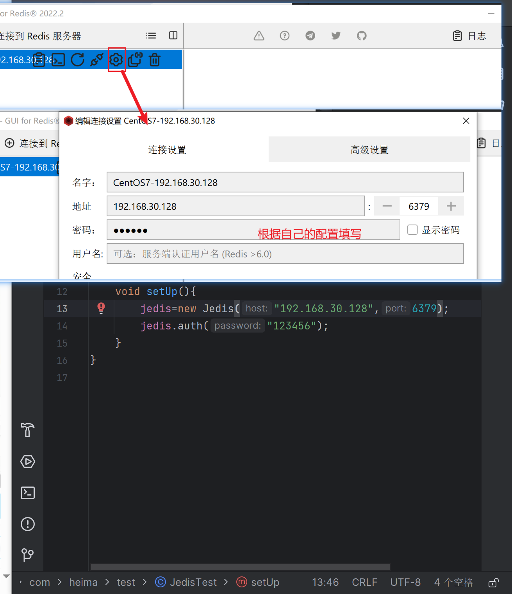

# redis客户端-jedis
## springboot配置jedis
### 配置依赖项
先从官网（github项目地址)找到对应的Maven依赖

复制到pom.xml文件当中，刷新Maven依赖；

由红变白就是依赖包下载完成，另外要配置单元测试的junit包

### 连接jedis
创建redis实例后，创建setup方法配置连接设置

## 单元测试
@BeforeEach注解

通过set、get方法存入、获取redis数据

内存回收，防止空指针

执行测试用例，查看结果：

哈希类型测试：

## Jedis 线程池
线程池工具类：

修改测试里的连接配置：

报错了，问了deepseek说是方法是旧版本，教程里是3.x
这里2025.8.16官方依赖是6.x

按照ds结论，决定修改springboot版本为3.x;
其他配置项也有响应修改；

所有的javax修改为jakarta

修改JedisConnectionFactory工具类的方法:

之后就可以运行了：
